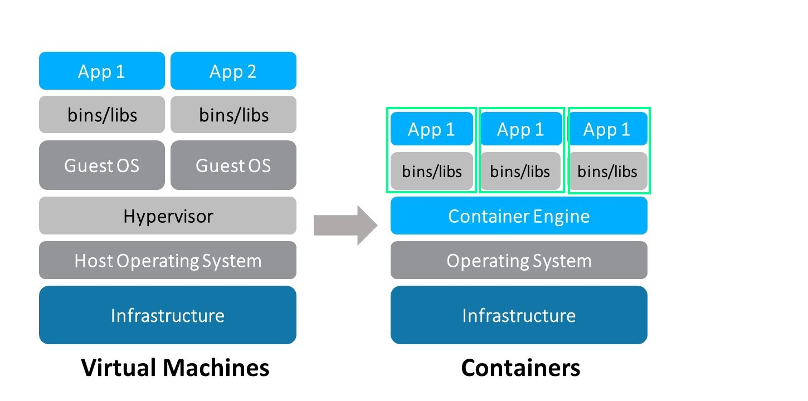

# Learning Azure Cloud 

## Cloud Computing
>Cloud computing is the on-demand availability of computer system resources, especially data storage and computing power. 

### Benefits
 - Fast access to resources
 - Pay for what we use
 - No capex/opex costs

## Deployment Models
- Private cloud
- Community Cloud
- Public Cloud
- Hybrid Cloud

## Service Models
- IaaS  - *Infrastructure as service*
- PaaS - *platform as service*
- SaaS - *software as service*

### IaaS  - *Infrastructure as service*
#### Virtualization
>Virtualization refers to the act of creating a virtual (rather than actual) version of something, including virtual computer hardware platforms, storage devices, and computer network resources.
>
>Virtualization is the logical division of physical computing resources
>
> 

#### Hypervisor
>A hypervisor or virtual machine monitor (VMM) is computer software, firmware or hardware that creates and runs virtual machines. 
>
> 

>#### Popular hypervisors available in the current market
> - ESXi -VMWare
> - Hyper-V - Microsoft
> - XenServer - Citrix

#### Containers
>A container is operating system level virtualization, where the OS kernel provides isolated user spaces to run specific application 
>
>Its a standard unit of software that packages up code and all its dependencies 
>
